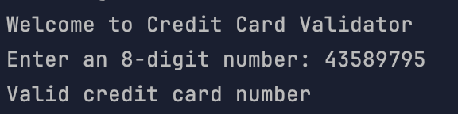
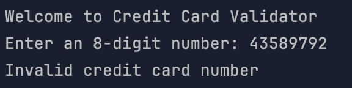

# Credit Card Validation
- Last Digit of a Credit Card Number is The Check Digit
- If The Last Digit of The Result is 0 Card is Valid
- Must Be Length Specified

_**Valid Number Example:**

**_Invalid Number Example:_**

**_Invalid Length Example:_**

